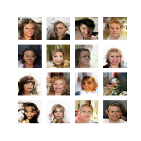
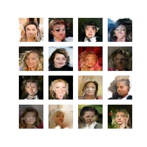
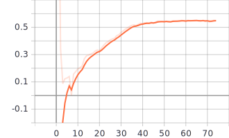
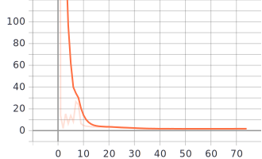
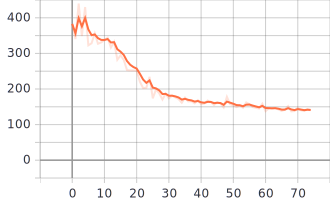

# dcgan-fake-faces

Deep convolutional generative adversarial networks (DCGANs) for generating fake faces with Tensorflow and Keras.

Final project for DD2424 Deep Learning in Data Science at KTH Royal Institute of Technology, Stockholm.

Note that this project is a fork of [Cool GANs and Fake Celebrities](https://github.com/DiogorPinheiro/Cool_GANs_Fake_Celebrities) that was a collaboration of the group:
- [Diogo Pinheiro](https://github.com/DiogorPinheiro)
- [Jakob Lindén](https://github.com/jakobGTO)
- [Patrick Jonsson](https://github.com/hiver-py)
- [Márk Antal Csizmadia](https://github.com/mark-antal-csizmadia)

## Data

The Large-scale CelebFaces Attributes (CelebA) Dataset is publicly available [here](http://mmlab.ie.cuhk.edu.hk/projects/CelebA.html).

The ```dcgan.ipynb``` includes code to download and prepare the dataset, but it can also be done manually.

## Implementation

The implementation follows that of [Unsupervised Representation Learning with Deep Convolutional Generative Adversarial Networks](https://arxiv.org/abs/1511.06434).

The code is in ```dcgan.ipynb```.

Our experiments and results are discussed in the [report](assets/report_and_presentation/report.pdf) and the [presentation](assets/report_and_presentation/Presentation.pdf)

The models are evaluated based on the generator and the discrimnator losses, and the Fréchet Inception Distance (FID) metric proposed in [GANs Trained by a Two Time-Scale Update Rule Converge to a Local Nash Equilibrium
](https://arxiv.org/abs/1706.08500).

Due to the limit of accessibility to adequate hardware to training the DCGAN on the original faces dataset dimensions of 218 x 178, the models are trained on 32 x 32 and 64 x 64 images.

The implementation is first tested on the MNIST dataset, and then on the faces dataset.

## Results

Some samples of generated images are shown below.

### MNIST Results

All the generated MNIST images are of size 28 x 28.  


### Faces Results

Below are some results of generating 32 x 32 images. After 75 epochs:





The GIFs show the evolution of the generator. The evolution of the 32 x 32 generator:


The evolution of the 64 x 64 generator:


## Logs

Training logs are located at ```logs``` and can be visualized with Tensorboard.

Some examples are shown below for a model trained on the 32 x 32 faces dataset.

### Discimator Loss



### Generator Loss



### FID Score




## Conclusions

GANs are cool, DCGANs are cooler.
