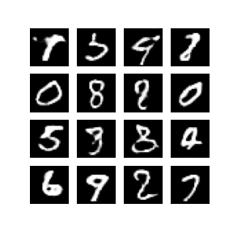

# dcgan-fake-faces

Deep convolutional generative adversarial networks (DCGANs) for generating fake faces with Tensorflow and Keras

## Data

The Large-scale CelebFaces Attributes (CelebA) Dataset is publicly available [here](http://mmlab.ie.cuhk.edu.hk/projects/CelebA.html).

The ```dcgan.ipynb``` includes code to download and prepare the dataset, but it can also be done manually.

## Implementation

The implementation follows that of [Unsupervised Representation Learning with Deep Convolutional Generative Adversarial Networks](https://arxiv.org/abs/1511.06434).

The code is in ```dcgan.ipynb```.

The models are evaluated based on the generator and the discrimnator losses, and the Fréchet Inception Distance (FID) metric proposed in [GANs Trained by a Two Time-Scale Update Rule Converge to a Local Nash Equilibrium
](https://arxiv.org/abs/1706.08500).

Due to the limit of accessability to adequate hardware to traing the DCGAN on the original faces dataset dimensions of 218 x 178, the models are trained on 32 x 32 and 64 x 64 images.

The implementation is first tested on the MNIST dataset, and then on the faces dataset.

## Results

Some samples of generated images are shown below.

### MNIST Results




### Faces Results


## Logs

Training logs are located at ```logs``` and can be visualized with Tensorboard.

Some examples are shown below for a model trained on the 32 x 32 faces dataset.

### Discimator Loss


### Generator Loss


### FID Score


## Conclusions

GANs are cool, DCGANs are cooler.
